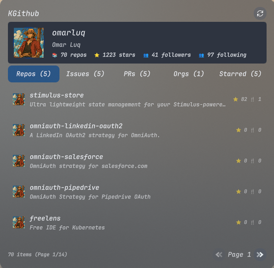
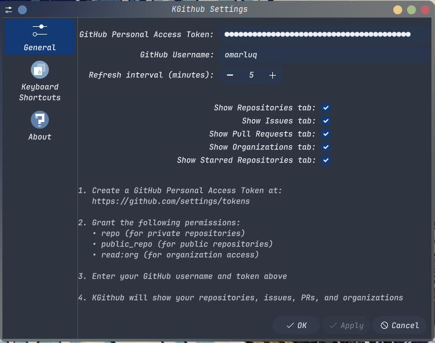
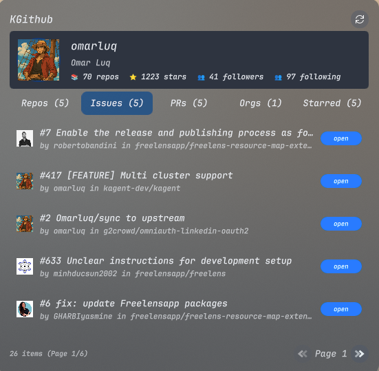
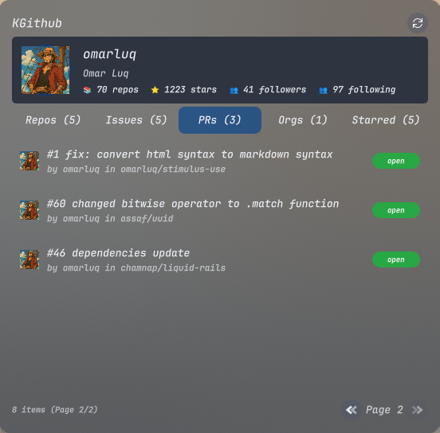
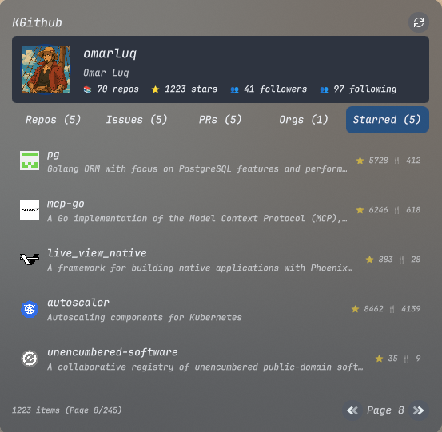

# KGitHub Plasmoid

> [!WARNING]
> This plasmoid is in early development. Expect bugs and breaking changes.

A KDE Plasma widget for GitHub integration that displays repositories, issues, pull requests, organizations, and starred repositories with a beautiful, responsive interface.



## ✨ Features

- 👤 **User Profile Display** - Shows your GitHub profile with avatar, repository count, and total stars
- 📁 **Repository Browser** - Browse your repositories with pagination and detailed information
- 🐛 **Issues Tracking** - Monitor open issues across all your repositories
- 🔄 **Pull Requests** - Keep track of your open pull requests
- 🏢 **Organizations** - View organizations you belong to
- ⭐ **Starred Repositories** - Browse your starred repositories
- 🎛️ **Configurable Interface** - Show/hide any tab to customize your workflow
- 🔄 **Auto-Refresh** - Configurable automatic refresh intervals



## 🔧 Installation

### Prerequisites

- **KDE Plasma 6.0+**
- **Qt 6.0+**
- **GitHub Personal Access Token**

### Install from Source

```bash
# Clone the repository
git clone https://github.com/omarluq/kgithub.git
cd kgithub

# Install the plasmoid
kpackagetool6 --type Plasma/Applet --install .

# Or update if already installed
kpackagetool6 --type Plasma/Applet --upgrade .
```

### Add to Desktop/Panel

1. Right-click on your desktop or panel
2. Select "Add Widgets..."
3. Search for "KGitHub"
4. Drag the widget to your desired location

## ⚙️ Configuration

### GitHub Token Setup

1. Go to [GitHub Personal Access Tokens](https://github.com/settings/tokens)
2. Click "Generate new token (classic)"
3. Select the following scopes:
   - `repo` - Access to private repositories
   - `public_repo` - Access to public repositories
   - `read:org` - Read organization membership
4. Copy the generated token

### Widget Configuration

1. Right-click the KGitHub widget
2. Select "Configure KGitHub..."
3. Enter your:
   - **GitHub Personal Access Token**
   - **GitHub Username**
   - **Refresh Interval** (1-60 minutes)
4. Choose which tabs to display:
   - Repositories
   - Issues
   - Pull Requests
   - Organizations
   - Starred Repositories


## 🖼️ Screenshots

### Repository View


_Repository browser with pagination and detailed information_

### Issues Tracking



_Monitor open issues across all repositories_

### Pull Requests



_Keep track of your open pull requests_

### Starred Repositories



_Browse your starred repositories_

## 🛠️ Development

### Setup Development Environment

```bash
# Clone the repository
git clone https://github.com/omarluq/kgithub.git
cd kgithub

# Install development dependencies
make setup
```

### Available Commands

```bash
# Code quality
make lint           # Run qmllint on all QML files
make clean          # Remove trailing whitespace and extra spaces
make pre-commit     # Run all pre-commit checks

# Development
make test           # Test plasmoid with plasmoidviewer
make help           # Show all available commands
```

### Testing

```bash
# Test the plasmoid in development
make test

# Or manually
plasmoidviewer -a . --formfactor desktop
```

## 🔒 Privacy & Security

- **Local Storage Only** - All data is cached locally in your KDE configuration
- **Secure Token Handling** - GitHub tokens are stored securely in KDE's configuration system
- **No External Services** - Direct GitHub API communication only
- **Rate Limit Aware** - Intelligent request throttling to respect GitHub's API limits

## 🐛 Troubleshooting

### Common Issues

**Widget shows "Please configure GitHub token"**

- Ensure you've entered a valid GitHub Personal Access Token in the configuration
- Verify the token has the required scopes (repo, public_repo, read:org)
- Check your GitHub username is correct

**Empty or outdated data**

- Try refreshing manually using the refresh button
- Check your internet connection
- Verify your GitHub token hasn't expired

**Performance issues**

- Increase the refresh interval in settings
- The widget uses intelligent caching to minimize API calls

### Getting Help

- 🐛 [Report Issues](https://github.com/omarluq/kgithub/issues)
- 💬 [Discussions](https://github.com/omarluq/kgithub/discussions)
- 📧 Email: <omar.luqman@hey.com>

## 🤝 Contributing

Contributions are welcome! Please feel free to submit a Pull Request. For major changes, please open an issue first to discuss what you would like to change.

### Development Workflow

1. Fork the repository
2. Create a feature branch (`git checkout -b feature/amazing-feature`)
3. Make your changes
4. Run tests and linting (`make pre-commit`)
5. Commit your changes (`git commit -m 'Add amazing feature'`)
6. Push to the branch (`git push origin feature/amazing-feature`)
7. Open a Pull Request

## 📄 License

This project is licensed under the MIT License - see the [LICENSE](LICENSE) file for details.

## 🙏 Acknowledgments

- Icons by [Icons8](https://icons8.com)
- Built for the amazing KDE Plasma desktop environment
- Inspired by the GitHub developer community

---

**Made with ❤️ for the KDE Community**
